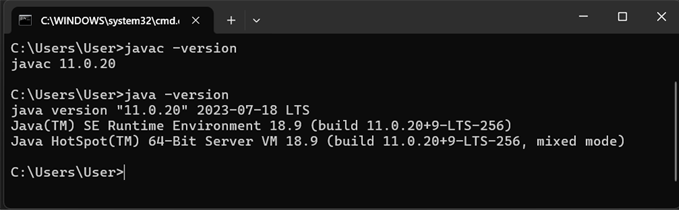
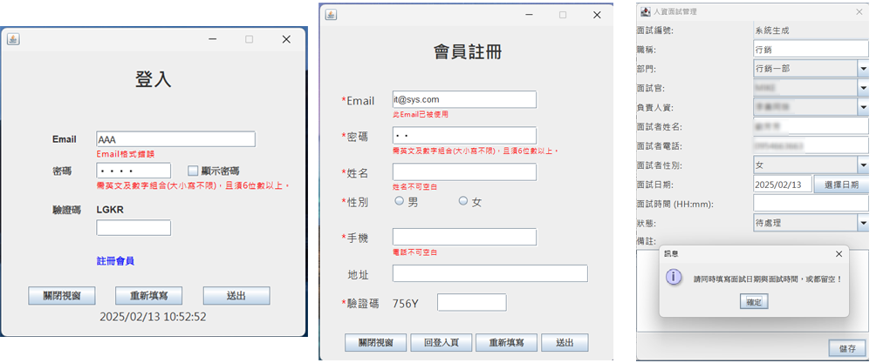
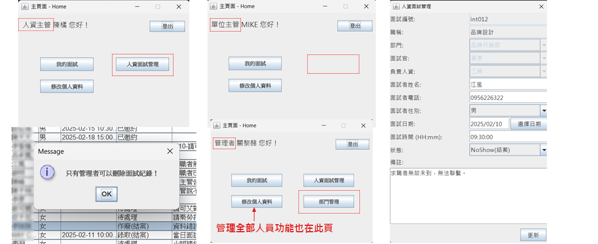
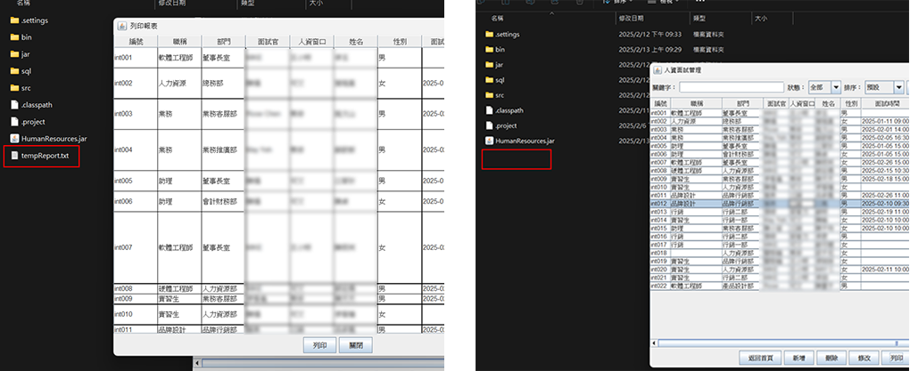

# HRIIS-Java-MySQL
A Human Resources Interview Invitation System built using Java (Swing) and MySQL. HRIIS-Java-MySQL is designed to effectively manage interview processes, invitation records, and statistical data. The system leverages a user-friendly interface developed with Java Swing and adopts a multi-layered architecture (MVC, DAO, Service, etc.) to enhance maintainability and scalability.  
HRIIS-Java-MySQL 是一個基於 Java 與 MySQL 技術打造的人資面試邀約系統，旨在有效管理面試流程、邀約記錄及統計數據。本系統利用 Java Swing 實作直觀的使用者介面，並採用多層分離的架構（如 MVC、DAO、Service 等）以提升維護性與擴充性。

---

## 概述

- 可輔助「管理員」，有效管理人員及部門，也可協助內部同仁修改部分資料。
- 供「單位主管(面試官)」查閱未來及歷史面試相關資訊。
- 提供「人資」在面試流程管控及「人資主管」在人員支配及輔助數據統計分析。

---

## 技術棧

- ### **程式語言：** Java  
- ### **UI 技術：** Java Swing  
- ### **資料庫：** MySQL
- ### **開發環境：** Eclipse IDE for Java Developers (2024-09)

---

## 專案結構

```plaintext
HumanResources/
└── Src/
    ├── chart/  
    │   ├── InterviewChartApp.java       // 求職者職稱與性別統計圖
    │   └── InterviewStatusChartApp.java   // 面試進度分析圖
    ├── Controller/                       *UI介面
    │   ├── department/  
    │   │   ├── DepartmentListFrame.java   // 部門列表
    │   │   └── DepartmentEditFrame.java   // 部門維護
    │   ├── interviewrecord/  
    │   │   ├── HRInterviewManagement.java // 邀約記錄列表
    │   │   ├── InterviewRecordEditDialog.java // 邀約記錄維護
    │   │   └── MyInterview.java           // 使用者參與面試列表
    │   └── member/  
    │       ├── Home.java                  // 首頁
    │       ├── Login.java                 // 登入頁
    │       ├── MemberEditDialog.java      // 管理人員維護
    │       ├── MemberManagementFrame.java // 管理人員列表
    │       ├── ProfileEditFrame.java      // 個人資料維護
    │       └── Register.java              // 註冊
    ├── Dao/                               *SQL單一功能化
    │   ├── DepartmentDao.java             // 部門
    │   ├── InterviewRecordDao.java        // 面試
    │   ├── MemberDao.java                 // 人員
    │   └── impl/  
    │       ├── DepartmentDaoImpl.java     // 部門
    │       ├── InterviewRecordDaoImpl.java// 面試
    │       └── MemberDaoImpl.java         // 會員
    ├── Model/                              *模組
    │   ├── Department.java                // 部門
    │   ├── InterviewRecord.java           // 面試
    │   └── Member.java                    // 人員
    ├── Service/                           *整合
    │   ├── DepartmentService.java         // 部門
    │   ├── InterviewRecordService.java    // 面試
    │   ├── MemberService.java             // 人員
    │   └── impl/  
    │       ├── DepartmentServiceImpl.java // 部門
    │       ├── InterviewRecordServiceImpl.java // 面試
    │       └── MemberServiceImpl.java     // 人員
    └── Util/  
        ├── Tool.java                      // 輔助功能
        └── StatusConstants.java           // 常數定義
```
---

## 下載資源

- ### **資料庫：** [檢視](https://github.com/MountainTea/HRIIS-Java-MySQL/tree/main/sql "MySQL資料表下載")
- ### **執行檔：** [檢視](https://github.com/MountainTea/HRIIS-Java-MySQL/tree/main/jar "(.jar)下載")  
 ※ 請將資料表(.sql)匯入再行啟動程式(.jar)。

---

## 測試環境

- ### **資料庫環境：**  
請安裝 MySQL（建議使用 [MySQL Community Server](https://dev.mysql.com/downloads/mysql/ "資料庫程式下載")），並匯入提供的 SQL 腳本建立所需的資料表。
- ### **JDK環境：**  
下載並安裝 [JDK 11](https://www.oracle.com/java/technologies/downloads/#java11?er=221886 "JDK程式下載")環境。
- ### **檢查Java 版本：**   
在 CMD 中執行下列命令以確認安裝版本。
```plaintext
javac -version
```
```plaintext
java -version
```
  </a>
  
---

## 部分功能說明

- ### **欄位驗證：**  
  部分欄位輸入時會有即時檢核機制，且帳號(E-mail)部分有唯一識別規範。  
(EX. 登入/註冊 帳號(E-mail)、密碼、姓名、電話、面試日期與時間必須同時輸入或都保持空白...等)  
</a> 

- ### **權限：**  
  部分頁面進入及使用權限有限制。  
(EX. 「人資/人資主管」 才具有 HR邀約列表 及 操作相關畫面 權限；「人資主管」才能檢視分析圖表 及 修改部分欄位；「管理員」為最高權限，方可進入 管理會員及部門資料。)  
</a> 

- ### **列印及篩選：**  
  部分管理列表可進行篩選及列印功能，其中列印功能 採IO暫存式列印，當關閉畫面後，暫存檔案(tempReport.txt)會刪除。  
  
  </a>  
